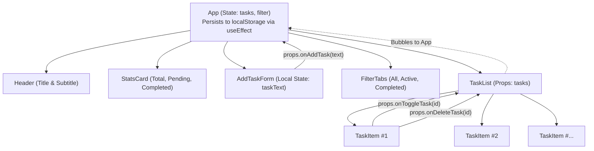

# Lab 3: Introduction to React.js — Component-Based To-Do App

## 🎯 Aim
Build a component-based front-end application using React.js.

## 📋 Tasks Implemented
1. **React Application Setup**: Configured with Vite for fast HMR and optimized builds.
2. **Component Breakdown**:
   - `App`: Central container holding state and orchestrating components.
   - `AddTaskForm`: Controlled input form for adding new to-do items.
   - `TaskList`: Container that iterates and displays tasks or an empty state.
   - `TaskItem`: Individual to-do item with checkbox, text styling, and delete action.
3. **Hooks Usage**:
   - `useState`: Manages task array state, active filter state, and form input state.
   - `useEffect`: Syncs task changes to browser `localStorage` automatically for persistence.
4. **Props-based Communication**:
   - Parent to Child: `tasks` passed to `TaskList` -> `TaskItem`.
   - Child to Parent: Callback functions (`onAddTask`, `onToggleTask`, `onDeleteTask`) triggered from children to update root state in `App`.

---

## 🌳 Component Tree Diagram



### ASCII Component Hierarchy
```text
App (Root)
│
├── Header
├── StatsCard (Calculated metrics)
├── AddTaskForm [props: onAddTask]
├── FilterTabs  [props: filter, setFilter]
└── TaskList    [props: tasks, onToggleTask, onDeleteTask]
    │
    ├── TaskItem [props: task, onToggleTask, onDeleteTask]
    ├── TaskItem ...
    └── EmptyState (rendered when tasks.length === 0)
```

---

## 🛠️ How to Run Locally

1. Navigate to the project folder:
   ```bash
   cd lab-3-todo-app
   ```
2. Install dependencies:
   ```bash
   npm install
   ```
3. Start the Vite development server:
   ```bash
   npm run dev
   ```
4. Open your browser at `http://localhost:3000` (or the port Vite outputs).

---

## 📦 Project Structure
```text
lab-3-todo-app/
├── index.html
├── package.json
├── vite.config.js
├── README.md
└── src/
    ├── main.jsx
    ├── App.jsx
    ├── index.css
    └── components/
        ├── AddTaskForm.jsx
        ├── TaskList.jsx
        └── TaskItem.jsx
```
