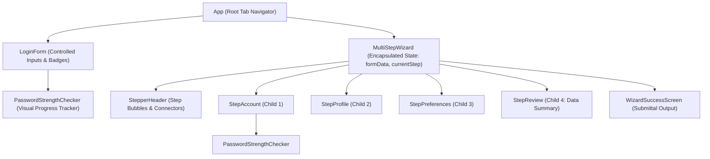

# Lab Sheet 05: Form Validation Architecture & Controlled Inputs in React

## 🎯 Aim & Syllabus Reference
Create a functional, responsive simple Login Form module using controlled component inputs inside the React JS library architecture, incorporating regex verification, dynamic password strength tracking, and an encapsulated multi-step onboarding wizard.

---

## 📋 Tasks Implemented

### Task 5.1: Dynamic Regex Criteria Verification & Interactive Warning Badges
- **Controlled Components**: Full two-way data binding with React `useState` managing field input events (`onChange`, `onBlur`).
- **Dynamic Regex Patterns**:
  - Email Validation: RFC 5322 regex (`/^[a-zA-Z0-9._%+-]+@[a-zA-Z0-9.-]+\.[a-zA-Z]{2,}$/`).
  - Username Security Pattern: Alphanumeric with underscores, length constraints (`/^[a-zA-Z][a-zA-Z0-9_]{2,19}$/`).
  - Phone Number Format: 10-digit international / national format regex.
- **Interactive Error Badges**: Dynamically displays high-visibility alert warning badges beneath inputs whenever security constraints or input parameters are violated.

### Task 5.2: Password Strength Checker Sub-Component
- **Modular Component**: `PasswordStrengthChecker.jsx` encapsulates real-time security scoring.
- **Dynamic Progress Tracker Bar**:
  - Dynamically calculates password strength score (0% to 100%).
  - Smooth animated transitions for bar width and color:
    - **Very Weak / Weak**: Red / Orange (0% - 40%)
    - **Fair**: Amber / Yellow (40% - 60%)
    - **Good**: Blue (60% - 80%)
    - **Strong**: Emerald Green (80% - 100%)
- **Interactive Checklist**: Real-time evaluation of:
  1. Minimum 8 characters
  2. Uppercase letter (A-Z)
  3. Lowercase letter (a-z)
  4. Numeric digit (0-9)
  5. Special character (`!@#$%^&*`)

### Task 5.3: Multi-Step User Onboarding Wizard
- **Encapsulated State Flow**: Centralized wizard state pipeline in `MultiStepWizard.jsx` that maintains data persistence across back-and-forth step transitions.
- **Child Components**:
  - `StepAccount.jsx`: Username, email, password strength checker.
  - `StepProfile.jsx`: Full name, verified phone number, primary role, bio.
  - `StepPreferences.jsx`: Two-Factor Authentication method (Authenticator vs. SMS), notification toggles, terms consent.
  - `StepReview.jsx`: Aggregated data summary card with quick step-jumping edits before final submission.
- **Strict Step Validation**: Users cannot progress to subsequent steps until active step validations pass.
- **Final Submittal Routine**: Simulates network request dispatch with loading indicators and formats a JSON payload confirmation screen.

---

## 🏗️ Architecture & Component Tree



---

## 🛠️ How to Run Locally

1. Navigate to the project directory:
   ```bash
   cd "labsheet-5-form-validation"
   ```
2. Install dependencies:
   ```bash
   npm install
   ```
3. Start the Vite development server:
   ```bash
   npm run dev
   ```
4. Open your browser at `http://localhost:3002`.

---

## 📦 Directory Structure
```text
labsheet-5-form-validation/
├── index.html
├── package.json
├── vite.config.js
├── README.md
└── src/
    ├── main.jsx
    ├── App.jsx
    ├── index.css
    ├── utils/
    │   └── validators.js                 # Regex rules & password score algorithms
    └── components/
        ├── LoginForm.jsx                 # Task 5.1 & 5.2 Login Controller
        ├── PasswordStrengthChecker.jsx   # Task 5.2 Dynamic Visual Progress Tracker
        └── wizard/                       # Task 5.3 Multi-step Onboarding Wizard
            ├── MultiStepWizard.jsx       # State encapsulation orchestrator
            ├── StepAccount.jsx           # Step 1 child component
            ├── StepProfile.jsx           # Step 2 child component
            ├── StepPreferences.jsx       # Step 3 child component
            └── StepReview.jsx            # Step 4 child component
```
